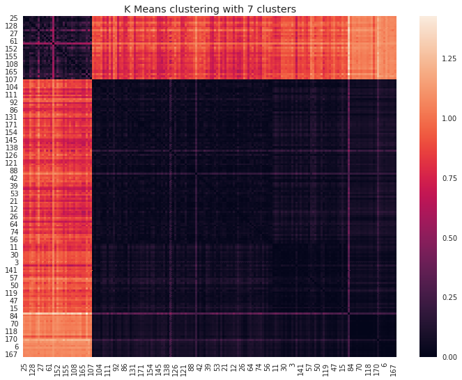

```python
import pydendroheatmap as pdh
from __future__ import print_function
#Sklearn
from sklearn.datasets import make_blobs
from sklearn.cluster import KMeans,DBSCAN
from sklearn.metrics import silhouette_samples, silhouette_score
from sklearn import metrics
from sklearn.decomposition import PCA
from sklearn.preprocessing import StandardScaler
import time
import warnings

import numpy as np
import matplotlib.pyplot as plt

from sklearn import cluster, datasets, mixture
from sklearn.neighbors import kneighbors_graph
from sklearn.preprocessing import StandardScaler
from itertools import cycle, islice
import sklearn
from sklearn.ensemble import RandomForestClassifier,RandomForestRegressor
from sklearn.model_selection import train_test_split
from sklearn.metrics import accuracy_score
from scipy.spatial.distance import pdist, squareform
from scipy.cluster.hierarchy import linkage, dendrogram
from scipy.cluster.hierarchy import cophenet
from scipy.cluster.hierarchy import inconsistent
from scipy.cluster.hierarchy import fcluster
import scipy.spatial as sp, scipy.cluster.hierarchy as hc


#Plot
import seaborn as sns
import matplotlib.pyplot as plt
import matplotlib.cm as cm
import numpy as np
import pandas as pd
print(__doc__)
from IPython.display import HTML
path = '/media/cotran/New Volume/REU_data'
small = '/CNCAU_1403-1509_R_v1_03-03-2016/'
new_features = '/New features computing/'
folder = '/Computing_features/'
df_final = pd.read_csv(path+folder+'Courses_DataFrame.csv')
from IPython.display import Latex
#Configure Visualization Defaults
#%matplotlib inline = show plots in Jupyter Notebook browser
#Visualization
import matplotlib as mpl
import matplotlib.pylab as pylab
from pandas.tools.plotting import scatter_matrix
%matplotlib inline
plt.style.use('ggplot')
sns.set_style('white')
pylab.rcParams['figure.figsize'] = 20,12
import numpy as np
from scipy.cluster.hierarchy import linkage, _LINKAGE_METHODS
from scipy.spatial.distance import pdist
from fastcluster import linkage as linkage_fc
```

    Automatically created module for IPython interactive environment


```python
HTML('''<script>
code_show=true; 
function code_toggle() {
 if (code_show){
 $('div.input').hide();
 } else {
 $('div.input').show();
 }
 code_show = !code_show
} 
$( document ).ready(code_toggle);
</script>
<form action="javascript:code_toggle()"><input type="submit" value="Click here to toggle on/off the raw code."></form>''')
```


<script>
code_show=true; 
function code_toggle() {
 if (code_show){
 $('div.input').hide();
 } else {
 $('div.input').show();
 }
 code_show = !code_show
} 
$( document ).ready(code_toggle);
</script>
<form action="javascript:code_toggle()"><input type="submit" value="Click here to toggle on/off the raw code."></form>


```python
df_mm = pd.read_csv('/media/cotran/New Volume/REU_data/Computing_features/Courses_minmax.csv')
df_std = pd.read_csv('/media/cotran/New Volume/REU_data/Computing_features/Courses_Standard.csv')
df_mm['course_id'] = df_final['course_id']
df_std['course_id'] = df_final['course_id']
df_mm['discipline'] = df_mm['discipline']*10
df_std['discipline'] = df_std['discipline']*10
```

# DBSCAN - K_mean - Hierarchical Clustering Comparing Notebook
- In this notebook, we will investigate applying differient clustering techniques in our data.
- Basic intuition about 3 techniques that we used in this notebook:
    - DBSCAN : It is a density-based clustering algorithm. The density means that given a set of points in space, it groups together points that are closely near each other. Then, it finds core samples of high density and expands clusters from them. The algorithm is very good for data which contains clusters of similar density. (outliers mean regions with low density).
    - K Mean : The KMeans algorithm clusters data by trying to separate samples in n groups of equal variance, minimizing a criterion known as the inertia or within-cluster sum-of-squares. This algorithm requires the number of clusters to be specified.
    - Hierchical Clustering: Hierarchical clustering is a general family of clustering algorithms that build nested clusters by merging or splitting them successively. This hierarchy of clusters is represented as a tree (or dendrogram). The root of the tree is the unique cluster that gathers all the samples, the leaves being the clusters with only one sample. 
        -  In this notebook, I use the Agglomerative Clustering, which performs a hierarchical clustering using a bottom up approach: each observation starts in its own cluster, and clusters are successively merged together. The linkage criteria determines the metric used for the merge strategy, specifically, I used the Ward linkage method:
            - Ward minimizes the sum of squared differences within all clusters. It is a variance-minimizing approach and in this sense is similar to the k-means objective function but tackled with an agglomerative hierarchical approach.
- A guess : K Mean and HAC may yield the same results due to the similarity of Ward linkage and K mean.

- Have a look at the dataset before clustering


```python
df.sample(5)
```


<div>
<style scoped>
    .dataframe tbody tr th:only-of-type {
        vertical-align: middle;
    }

    .dataframe tbody tr th {
        vertical-align: top;
    }

    .dataframe thead th {
        text-align: right;
    }
</style>
<table border="1" class="dataframe">
  <thead>
    <tr style="text-align: right;">
      <th></th>
      <th>conversation_character_count</th>
      <th>type_attach_count</th>
      <th>conversation_count</th>
      <th>number_of_discussion_entries</th>
      <th>total_discus_character_count</th>
      <th>character_per_dis_ratio</th>
      <th>number_of_discussion_topics</th>
      <th>total_topic_character_count</th>
      <th>character_topic_ratio</th>
      <th>quiz_count</th>
      <th>quiz_avg_score</th>
      <th>quiz_time_taken</th>
      <th>quiz_avg_attempts</th>
      <th>mean_final_score</th>
      <th>student_count</th>
      <th>wiki_view_count</th>
      <th>wiki_total_character_count</th>
      <th>wiki_page_count</th>
    </tr>
  </thead>
  <tbody>
    <tr>
      <th>19</th>
      <td>8.735570e-04</td>
      <td>0.000000</td>
      <td>0.002814</td>
      <td>0.003957</td>
      <td>0.006637</td>
      <td>0.932851</td>
      <td>0.004098</td>
      <td>0.016490</td>
      <td>0.598002</td>
      <td>0.013846</td>
      <td>0.357279</td>
      <td>0.000702</td>
      <td>0.548983</td>
      <td>0.272334</td>
      <td>0.017024</td>
      <td>0.005815</td>
      <td>0.008728</td>
      <td>0.008808</td>
    </tr>
    <tr>
      <th>136</th>
      <td>2.456138e-04</td>
      <td>0.002958</td>
      <td>0.000429</td>
      <td>0.076005</td>
      <td>0.096690</td>
      <td>0.701522</td>
      <td>0.002849</td>
      <td>0.003269</td>
      <td>0.169304</td>
      <td>0.262840</td>
      <td>0.404514</td>
      <td>0.000397</td>
      <td>0.140508</td>
      <td>0.507906</td>
      <td>0.083210</td>
      <td>0.006661</td>
      <td>0.002714</td>
      <td>0.001187</td>
    </tr>
    <tr>
      <th>62</th>
      <td>6.287568e-08</td>
      <td>0.000000</td>
      <td>0.000000</td>
      <td>0.014766</td>
      <td>0.009079</td>
      <td>0.303255</td>
      <td>0.000098</td>
      <td>0.000139</td>
      <td>0.125507</td>
      <td>0.214201</td>
      <td>0.427686</td>
      <td>0.000411</td>
      <td>0.025084</td>
      <td>0.128547</td>
      <td>0.128511</td>
      <td>0.001860</td>
      <td>0.001498</td>
      <td>0.000474</td>
    </tr>
    <tr>
      <th>36</th>
      <td>2.269598e-04</td>
      <td>0.054539</td>
      <td>0.000588</td>
      <td>0.026807</td>
      <td>0.014766</td>
      <td>0.264349</td>
      <td>0.004316</td>
      <td>0.005816</td>
      <td>0.200433</td>
      <td>0.024970</td>
      <td>0.363894</td>
      <td>0.002593</td>
      <td>0.248685</td>
      <td>0.268063</td>
      <td>0.030852</td>
      <td>0.002889</td>
      <td>0.004029</td>
      <td>0.003271</td>
    </tr>
    <tr>
      <th>141</th>
      <td>2.198240e-05</td>
      <td>0.000000</td>
      <td>0.000160</td>
      <td>0.018894</td>
      <td>0.009803</td>
      <td>0.245196</td>
      <td>0.006182</td>
      <td>0.006166</td>
      <td>0.149077</td>
      <td>0.023787</td>
      <td>0.325931</td>
      <td>0.001311</td>
      <td>0.296097</td>
      <td>0.805937</td>
      <td>0.007868</td>
      <td>0.007513</td>
      <td>0.004071</td>
      <td>0.002185</td>
    </tr>
  </tbody>
</table>
</div>


```python
df.describe()
```


<div>
<style scoped>
    .dataframe tbody tr th:only-of-type {
        vertical-align: middle;
    }

    .dataframe tbody tr th {
        vertical-align: top;
    }

    .dataframe thead th {
        text-align: right;
    }
</style>
<table border="1" class="dataframe">
  <thead>
    <tr style="text-align: right;">
      <th></th>
      <th>conversation_character_count</th>
      <th>type_attach_count</th>
      <th>conversation_count</th>
      <th>number_of_discussion_entries</th>
      <th>total_discus_character_count</th>
      <th>character_per_dis_ratio</th>
      <th>number_of_discussion_topics</th>
      <th>total_topic_character_count</th>
      <th>character_topic_ratio</th>
      <th>quiz_count</th>
      <th>quiz_avg_score</th>
      <th>quiz_time_taken</th>
      <th>quiz_avg_attempts</th>
      <th>mean_final_score</th>
      <th>student_count</th>
      <th>wiki_view_count</th>
      <th>wiki_total_character_count</th>
      <th>wiki_page_count</th>
    </tr>
  </thead>
  <tbody>
    <tr>
      <th>count</th>
      <td>178.000000</td>
      <td>178.000000</td>
      <td>178.000000</td>
      <td>178.000000</td>
      <td>178.000000</td>
      <td>178.000000</td>
      <td>178.000000</td>
      <td>178.000000</td>
      <td>178.000000</td>
      <td>178.000000</td>
      <td>178.000000</td>
      <td>178.000000</td>
      <td>178.000000</td>
      <td>178.000000</td>
      <td>178.000000</td>
      <td>178.000000</td>
      <td>178.000000</td>
      <td>178.000000</td>
    </tr>
    <tr>
      <th>mean</th>
      <td>0.008450</td>
      <td>0.013744</td>
      <td>0.011170</td>
      <td>0.037981</td>
      <td>0.027017</td>
      <td>0.315813</td>
      <td>0.013557</td>
      <td>0.019027</td>
      <td>0.237731</td>
      <td>0.070487</td>
      <td>0.348353</td>
      <td>0.006953</td>
      <td>0.188794</td>
      <td>0.254796</td>
      <td>0.056031</td>
      <td>0.012569</td>
      <td>0.017818</td>
      <td>0.013587</td>
    </tr>
    <tr>
      <th>std</th>
      <td>0.075038</td>
      <td>0.077441</td>
      <td>0.075545</td>
      <td>0.099784</td>
      <td>0.084923</td>
      <td>0.187477</td>
      <td>0.079090</td>
      <td>0.089729</td>
      <td>0.132570</td>
      <td>0.117741</td>
      <td>0.108887</td>
      <td>0.074888</td>
      <td>0.199360</td>
      <td>0.196254</td>
      <td>0.089660</td>
      <td>0.081549</td>
      <td>0.082071</td>
      <td>0.078681</td>
    </tr>
    <tr>
      <th>min</th>
      <td>0.000000</td>
      <td>0.000000</td>
      <td>0.000000</td>
      <td>0.000000</td>
      <td>0.000000</td>
      <td>0.000000</td>
      <td>0.000000</td>
      <td>0.000000</td>
      <td>0.000000</td>
      <td>0.000000</td>
      <td>0.000000</td>
      <td>0.000000</td>
      <td>0.000000</td>
      <td>0.000000</td>
      <td>0.000000</td>
      <td>0.000000</td>
      <td>0.000000</td>
      <td>0.000000</td>
    </tr>
    <tr>
      <th>25%</th>
      <td>0.000010</td>
      <td>0.000000</td>
      <td>0.000056</td>
      <td>0.007832</td>
      <td>0.003990</td>
      <td>0.195092</td>
      <td>0.001148</td>
      <td>0.001558</td>
      <td>0.163918</td>
      <td>0.015296</td>
      <td>0.303122</td>
      <td>0.000443</td>
      <td>0.025223</td>
      <td>0.108271</td>
      <td>0.017095</td>
      <td>0.001861</td>
      <td>0.001579</td>
      <td>0.001437</td>
    </tr>
    <tr>
      <th>50%</th>
      <td>0.000101</td>
      <td>0.000000</td>
      <td>0.000353</td>
      <td>0.016941</td>
      <td>0.009330</td>
      <td>0.264930</td>
      <td>0.002840</td>
      <td>0.004141</td>
      <td>0.215955</td>
      <td>0.029231</td>
      <td>0.360231</td>
      <td>0.000603</td>
      <td>0.128538</td>
      <td>0.211987</td>
      <td>0.036074</td>
      <td>0.003468</td>
      <td>0.004050</td>
      <td>0.002846</td>
    </tr>
    <tr>
      <th>75%</th>
      <td>0.001539</td>
      <td>0.003242</td>
      <td>0.005658</td>
      <td>0.031726</td>
      <td>0.020568</td>
      <td>0.375194</td>
      <td>0.005446</td>
      <td>0.009166</td>
      <td>0.289130</td>
      <td>0.072130</td>
      <td>0.414621</td>
      <td>0.001124</td>
      <td>0.294303</td>
      <td>0.354888</td>
      <td>0.068464</td>
      <td>0.005779</td>
      <td>0.008982</td>
      <td>0.005989</td>
    </tr>
    <tr>
      <th>max</th>
      <td>1.000000</td>
      <td>1.000000</td>
      <td>1.000000</td>
      <td>1.000000</td>
      <td>1.000000</td>
      <td>1.000000</td>
      <td>1.000000</td>
      <td>1.000000</td>
      <td>1.000000</td>
      <td>1.000000</td>
      <td>1.000000</td>
      <td>1.000000</td>
      <td>1.000000</td>
      <td>1.000000</td>
      <td>1.000000</td>
      <td>1.000000</td>
      <td>1.000000</td>
      <td>1.000000</td>
    </tr>
  </tbody>
</table>
</div>


# Hierarchical Clustering
- Using silhouette score to choose the best cut off distance.
- Compute the cophenet score for the ward linkage method.
- Plot the distance similarity heat map.


```python
df = df_mm.drop(columns=['discipline','course_id']).copy()
Z = linkage(df, 'ward')
```

 - The cophenetic correlation for a cluster tree is defined as the linear correlation coefficient between the cophenetic distances obtained from the tree, and the original distances (or dissimilarities) used to construct the tree. Thus, it is a measure of how faithfully the tree represents the dissimilarities among observations.

- The cophenetic distance between two observations is represented in a dendrogram by the height of the link at which those two observations are first joined. That height is the distance between the two subclusters that are merged by that link.

 - The output value, c, is the cophenetic correlation coefficient. The magnitude of this value should be very close to 1 for a high-quality solution. 


```python
c, coph_dists = cophenet(Z, pdist(df))
print('cophenet score for the ward linkage : %f' %c)
```

    cophenet score for the ward linkage : 0.532821


 - Try different parameters for the best silhouette score.


```python
for n in np.arange(0.5,3,0.1):
    max_d = n
    clusters = fcluster(Z, max_d, criterion='distance')
    silhouette_score = metrics.silhouette_score(df, clusters,
                                      metric='euclidean')
    c, coph_dists = cophenet(Z, pdist(df))
    print('max_distance = %f,number of clusters = %f, silhouette_score = %f' %
          (max_d,clusters.max(),silhouette_score))
```

    max_distance = 0.500000,number of clusters = 40.000000, silhouette_score = 0.191249
    max_distance = 0.600000,number of clusters = 31.000000, silhouette_score = 0.192446
    max_distance = 0.700000,number of clusters = 25.000000, silhouette_score = 0.183386
    max_distance = 0.800000,number of clusters = 25.000000, silhouette_score = 0.183386
    max_distance = 0.900000,number of clusters = 21.000000, silhouette_score = 0.161730
    max_distance = 1.000000,number of clusters = 18.000000, silhouette_score = 0.150428
    max_distance = 1.100000,number of clusters = 14.000000, silhouette_score = 0.188010
    max_distance = 1.200000,number of clusters = 12.000000, silhouette_score = 0.182205
    max_distance = 1.300000,number of clusters = 11.000000, silhouette_score = 0.181101
    max_distance = 1.400000,number of clusters = 10.000000, silhouette_score = 0.260764
    max_distance = 1.500000,number of clusters = 8.000000, silhouette_score = 0.257966
    max_distance = 1.600000,number of clusters = 8.000000, silhouette_score = 0.257966
    max_distance = 1.700000,number of clusters = 7.000000, silhouette_score = 0.254012
    max_distance = 1.800000,number of clusters = 7.000000, silhouette_score = 0.254012
    max_distance = 1.900000,number of clusters = 7.000000, silhouette_score = 0.254012
    max_distance = 2.000000,number of clusters = 6.000000, silhouette_score = 0.252404
    max_distance = 2.100000,number of clusters = 6.000000, silhouette_score = 0.252404
    max_distance = 2.200000,number of clusters = 6.000000, silhouette_score = 0.252404
    max_distance = 2.300000,number of clusters = 6.000000, silhouette_score = 0.252404
    max_distance = 2.400000,number of clusters = 6.000000, silhouette_score = 0.252404
    max_distance = 2.500000,number of clusters = 6.000000, silhouette_score = 0.252404
    max_distance = 2.600000,number of clusters = 6.000000, silhouette_score = 0.252404
    max_distance = 2.700000,number of clusters = 4.000000, silhouette_score = 0.196229
    max_distance = 2.800000,number of clusters = 3.000000, silhouette_score = 0.194805
    max_distance = 2.900000,number of clusters = 3.000000, silhouette_score = 0.194805


 - The cut off distance btwn 1.4 and 1.5 yields the best silhouette_score.
 - Let investigate on the cut off distance.


```python
max_d = 1.4
clusters = fcluster(Z, max_d, criterion='distance')
df_ward = df.copy()
df_ward['cluster'] = clusters
%matplotlib inline
mpl.style.use('ggplot')
sns.set_style('white')
pylab.rcParams['figure.figsize'] = 12,9
g = sns.countplot(df_ward['cluster'])
g.set_title('Number of courses per cluster using Hierarchical Clustering')
df_ward['cluster'].value_counts()
```


    3     90
    7     31
    9     29
    4     13
    5      5
    6      4
    8      3
    10     1
    2      1
    1      1
    Name: cluster, dtype: int64


- There are 10 clusters with number of courses in range (1-90)
- If we only choose cluster > 10, the result may be better


```python
DF_corr = df.T.corr()
DF_dism = 1 - DF_corr   # distance matrix
linkage = hc.linkage(sp.distance.squareform(DF_dism), method='ward')
dis_heat_map = sns.clustermap(DF_dism, row_linkage=linkage, col_linkage=linkage)
dis_heat_map.fig.suptitle('Distance Similarity heat map using Hierarchical Clustering with Ward linkage method') 
```


    Text(0.5,0.98,'Distance Similarity heat map using Hierarchical Clustering with Ward linkage method')


 - Heat map for the 1.4 cut off.


```python
df_ward = df_ward.sort_values(by=['cluster'])
DF_corr = df_ward.T.corr()
DF_dism = 1 - DF_corr 
ax = sns.heatmap(DF_dism)
ax.set_title('HAC with 1.4 cut off line')
```


    Text(0.5,1,'HAC with 1.4 cut off line')


# K-Mean clustering
- First, choose the best number of clusters based on the silhouette score.
- Plot the distance similarity heat map.


```python
for n in np.arange(3,20,1):
    estimator = KMeans(init='k-means++', n_clusters=n)
    estimator.fit(df)
    y_predict = estimator.predict(df)
    silhouette_score = metrics.silhouette_score(df, estimator.labels_,
                                      metric='euclidean')
    print('number of clusters = %f, silhouette_score = %f' %(n,silhouette_score))
```

    number of clusters = 3.000000, silhouette_score = 0.205935
    number of clusters = 4.000000, silhouette_score = 0.213508
    number of clusters = 5.000000, silhouette_score = 0.234389
    number of clusters = 6.000000, silhouette_score = 0.260838
    number of clusters = 7.000000, silhouette_score = 0.268992
    number of clusters = 8.000000, silhouette_score = 0.220120
    number of clusters = 9.000000, silhouette_score = 0.218472
    number of clusters = 10.000000, silhouette_score = 0.208612
    number of clusters = 11.000000, silhouette_score = 0.219005
    number of clusters = 12.000000, silhouette_score = 0.203963
    number of clusters = 13.000000, silhouette_score = 0.193386
    number of clusters = 14.000000, silhouette_score = 0.156634
    number of clusters = 15.000000, silhouette_score = 0.174905
    number of clusters = 16.000000, silhouette_score = 0.173752
    number of clusters = 17.000000, silhouette_score = 0.168252
    number of clusters = 18.000000, silhouette_score = 0.183504
    number of clusters = 19.000000, silhouette_score = 0.178497


- K Means with 7 clusters has the highest silhouette score - even comparing to the Ward linkage method.


```python
estimator = KMeans(init='k-means++', n_clusters=7)
estimator.fit(df)
y_predict = estimator.predict(df)
df_k_mean = df.copy()
df_k_mean['cluster'] = y_predict
df_k_mean = df_k_mean.sort_values(by=['cluster'])
df_corr = df_k_mean.T.corr()
df_dism = 1 - df_corr   # distance matrix
ax = sns.heatmap(df_dism)
ax.set_title('K Means clustering with 7 clusters')
```


    Text(0.5,1,'K Means clustering with 7 clusters')





```python
%matplotlib inline
mpl.style.use('ggplot')
sns.set_style('white')
pylab.rcParams['figure.figsize'] = 12,9
g = sns.countplot(df_k_mean['cluster'])
df_k_mean['cluster'].value_counts()
```


    6    86
    1    37
    5    36
    0    13
    3     4
    4     1
    2     1
    Name: cluster, dtype: int64


- Notice that:
    - The number of coures per cluster can be range from 1-86.
    - The clusters are well separated.
    - The highest cluster has the same number of courses comparing to the Hierarchical Clustering.
    - If we cut off the small cluster, the result may be the same as the Hierarchical Clustering

# DBSCAN
- We choose the best parameters based on the silhouette score : 
    - eps (The maximum distance between two samples for them to be considered as in the same neighborhood)
    - min_samples (The number of samples (or total weight) in a neighborhood for a point to be considered as a core point. This includes the point itself.)
- Plot the heat map.


```python
for m in range(3,6,1):
    for n in np.arange(0.1,0.5,0.05):
        min_samples = m
        estimator = DBSCAN(eps=n, min_samples=min_samples)
        y_predict = estimator.fit_predict(df)
        silhouette_score = metrics.silhouette_score(df, estimator.labels_,
                                          metric='euclidean')
        print('eps = %f, silhouette_score = %f, number of clusters = %d,min_samples = %d' 
              %(n,silhouette_score,len(np.unique(y_predict)),min_samples))
```

    eps = 0.100000, silhouette_score = -0.218592, number of clusters = 3,min_samples = 3
    eps = 0.150000, silhouette_score = -0.166690, number of clusters = 5,min_samples = 3
    eps = 0.200000, silhouette_score = 0.182986, number of clusters = 3,min_samples = 3
    eps = 0.250000, silhouette_score = 0.365152, number of clusters = 2,min_samples = 3
    eps = 0.300000, silhouette_score = 0.423102, number of clusters = 2,min_samples = 3
    eps = 0.350000, silhouette_score = 0.447727, number of clusters = 2,min_samples = 3
    eps = 0.400000, silhouette_score = 0.473987, number of clusters = 2,min_samples = 3
    eps = 0.450000, silhouette_score = 0.508696, number of clusters = 2,min_samples = 3
    eps = 0.100000, silhouette_score = -0.234552, number of clusters = 4,min_samples = 4
    eps = 0.150000, silhouette_score = -0.187809, number of clusters = 5,min_samples = 4
    eps = 0.200000, silhouette_score = 0.134944, number of clusters = 3,min_samples = 4
    eps = 0.250000, silhouette_score = 0.357429, number of clusters = 2,min_samples = 4
    eps = 0.300000, silhouette_score = 0.423102, number of clusters = 2,min_samples = 4
    eps = 0.350000, silhouette_score = 0.447727, number of clusters = 2,min_samples = 4
    eps = 0.400000, silhouette_score = 0.473987, number of clusters = 2,min_samples = 4
    eps = 0.450000, silhouette_score = 0.508696, number of clusters = 2,min_samples = 4
    eps = 0.100000, silhouette_score = -0.189385, number of clusters = 2,min_samples = 5
    eps = 0.150000, silhouette_score = -0.159177, number of clusters = 4,min_samples = 5
    eps = 0.200000, silhouette_score = 0.116643, number of clusters = 3,min_samples = 5
    eps = 0.250000, silhouette_score = 0.350799, number of clusters = 2,min_samples = 5
    eps = 0.300000, silhouette_score = 0.423102, number of clusters = 2,min_samples = 5
    eps = 0.350000, silhouette_score = 0.447727, number of clusters = 2,min_samples = 5
    eps = 0.400000, silhouette_score = 0.473987, number of clusters = 2,min_samples = 5
    eps = 0.450000, silhouette_score = 0.508696, number of clusters = 2,min_samples = 5


- Although there are many high silhouette_score but the number of clusters are only 2, so we will choose to investigate 2 pair of parameters:
    - eps = 0.200000, silhouette_score = 0.182986, number of clusters = 3,min_samples = 3
    - eps = 0.150000, silhouette_score = -0.159177, number of clusters = 4,min_samples = 5


```python
estimator = DBSCAN(eps=0.2, min_samples=3)
y_predict = estimator.fit_predict(df)
df_db = df.copy()
df_db['cluster'] = y_predict
df_db = df_db.sort_values(by=['cluster'])
df_db_corr = df_db.T.corr()
df_db_dism = 1 - df_db_corr   # distance matrix
sns.set(font="monospace")
ax = sns.heatmap(df_db_dism)
ax.set_title('DBSCAN with eps=0.2, min_samples=3 and 3 clusters')
```


    Text(0.5,1,'DBSCAN with eps=0.2, min_samples=3 and 3 clusters')


```python
%matplotlib inline
mpl.style.use('ggplot')
sns.set_style('white')
pylab.rcParams['figure.figsize'] = 12,9
g = sns.countplot(df_db['cluster'])
df_db['cluster'].value_counts()
```


     0    125
    -1     47
     1      6
    Name: cluster, dtype: int64


```python
estimator = DBSCAN(eps=0.15, min_samples=5)
y_predict = estimator.fit_predict(df)
df_db = df.copy()
df_db['cluster'] = y_predict
df_db = df_db.sort_values(by=['cluster'])
df_db_corr = df_db.T.corr()
df_db_dism = 1 - df_db_corr   # distance matrix
sns.set(font="monospace")
ax = sns.heatmap(df_db_dism)
ax.set_title('DBSCAN with eps=0.15, min_samples=5 and 4 clusters')
```


    Text(0.5,1,'DBSCAN with eps=0.15, min_samples=5 and 4 clusters')


```python
%matplotlib inline
mpl.style.use('ggplot')
sns.set_style('white')
pylab.rcParams['figure.figsize'] = 12,9
g = sns.countplot(df_db['cluster'])
df_db['cluster'].value_counts()
g.set_title('DBSCAN with eps=0.15, min_samples=5 and 4 clusters, Courses per cluster distribution')
```


    Text(0.5,1,'DBSCAN with eps=0.15, min_samples=5 and 4 clusters, Courses per cluster distribution')


- However, the negative silhouete score is -0.159177 .Values near 0 indicate overlapping clusters. Negative values generally indicate that a sample has been assigned to the wrong cluster, as a different cluster is more similar. Although the  distance similarity heat map shows well separate areas.

# Conclusion:
- Based on the results we can conclude that:
    -DBSCAN doesnt provide the result with high number of clusters
         -The reason may be because there are a lot of outliers in the courses.
    -K Mean 7 clusters and HAC 1.4 cut off line are almost identically similar.

- Next notebook, we will look deeper into the structure of clusters and its characteristics using PCA and classification approach.
